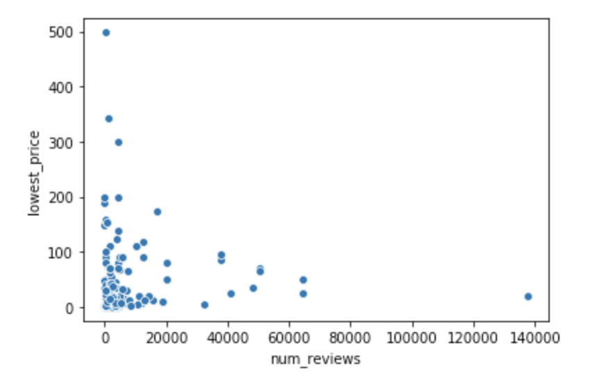
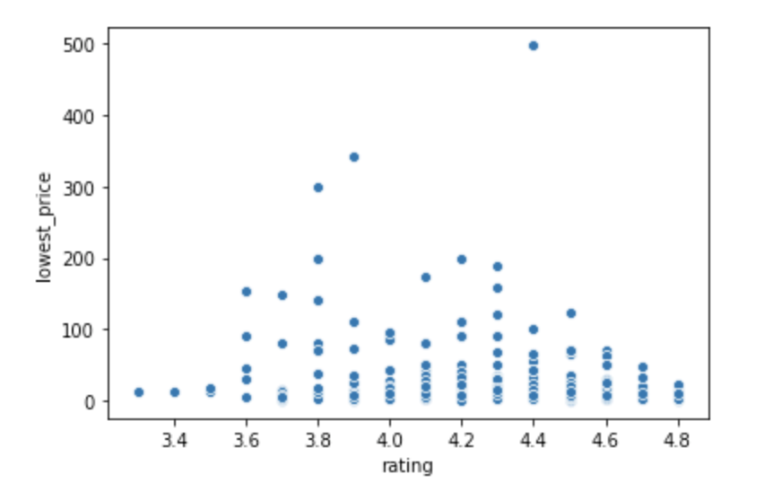
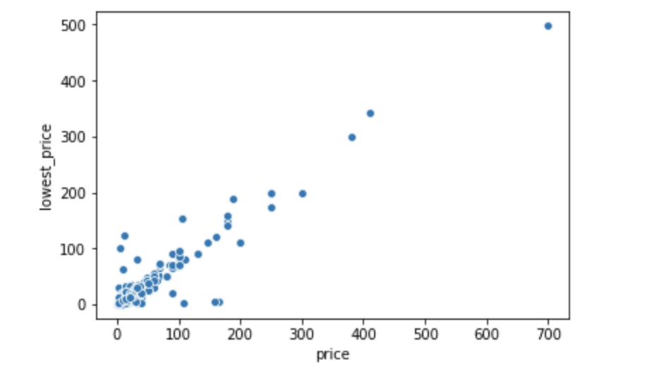

# Amazon Price Prediction - Multiple Regression

## Using Supervised Machine Learning to predict Amazon product price

### About the Project
This is the first project where I actually got to create a simple model for prediction. 
Initially the goals were: 
- Using Multiple Linear Regression to see if a product is likely to have a decrease in price
- To see if there is a month in a year where product prices are generally lower than other months

After a few days working on this project, I realized that the data I had was not appropriate to perfrom these tasks. So in this README, I will walk you through the initial process and later point out the big mistake that's why this doesn't work.

### Dataset
Data for 350+ Products from Amazom and their corresponding price history from camelcamelcamel.com

**Features:**
- highest price and month for highest price
- current price and month for current price
- lowest price and month for lowest price
- product rating
- number of reviews
- product category

### Exploratory Data Analysis (EDA)

There was not really a relationship between lowest price and number of review.

Similar for product rating, I couldn't really tell if it has a predictive power on lowest price.

However, looking at this graph, I could see that there was a really nice linear relationship here. I then created a simple linear regression using all the features listed above and got R-squared of 0.96. I thought to myself that it was so nice to have such high R-squared but **NO!!!** This was where it all went wrong.

### The Big Mistake
With the help from a friend who is working in Machine Learning and some research, I found out that I had **DATA LEAKAGE**.

Data Leakage happens when the data you are using contains information on what you are trying to predict.
From the plot above of price vs. lowest price, it's clear that they are related to each other.

Another definition of Data Leakage is when data used at training time is unavailable at inference time. In other words, it’s the problem results from using variables in your prediction model that are known only after the act of interest.

I also violated this definition that it would not be able to know these information (highest and current price) at the time I try to predict the lowest price in real life.

You can read more about it in my full [blog](https://medium.com/@quannguyen234/too-good-to-be-true-c1fc04cb07ea). 

